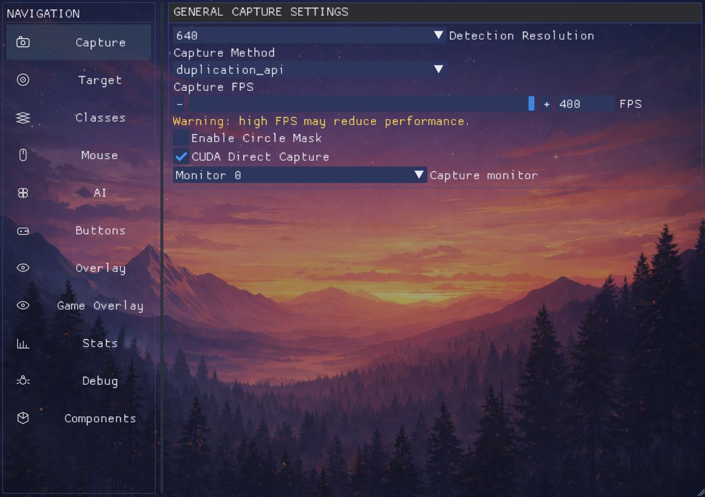
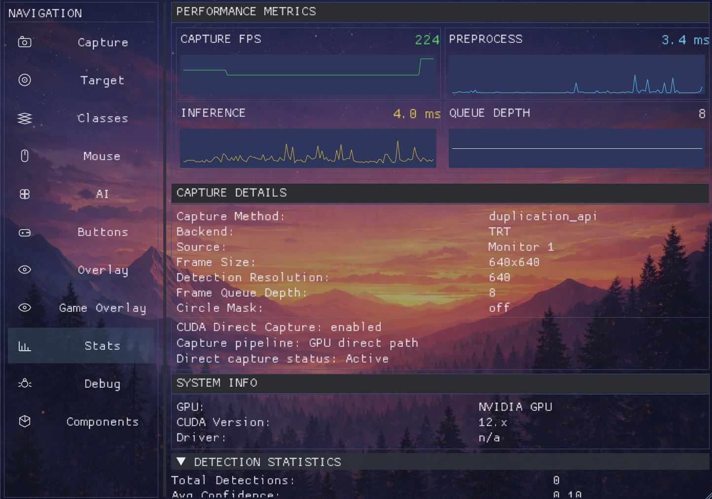

# 🎯 RN_AI_cpp — AI Aim Assistant

<div align="center">


[🚀 Быстрый старт](#-быстрый-старт) • [📚 Документация](#-технические-детали) * [English README](README.md)


</div>


## ✨ Возможности

| | |
|---|---|
| **🎯 AI Detection** | Детектирование целей через нейросети с высокой точностью |
| **🎨 Color Detection** | Определение цели по цвету через фильтрацию |
| **📈 Real-time Stats** | FPS счетчик и информация о задержке |
| **🖱️ Aim Simulator** | Визуализация предсказания движения цели |
| **🎛️ ClassTable** | Динамическое управление классами в реальном времени |
| **🔄 Kalman Filter** | Сглаживание движения без дрожания прицела |
| **⚡ Multiple Backends** | DirectML, CUDA+TensorRT, Color Detection |

---

## 🚀 Быстрый старт

### 1️⃣ Выберите сборку

<details open>
<summary><b>🟢 DirectML (Универсальная)</b></summary>

**Для:** Любые GPU (NVIDIA, AMD, Intel, встроенная видеокарта)

```
✅ Windows 10/11 (x64)
✅ Без необходимости CUDA
✅ Авто-рекомендуется для старых GPU
```

**Рекомендуется для:**
- GTX 10xx/9xx/7xx серии
- AMD Radeon GPU
- Intel Iris/Xe GPU
- Ноутбуки и офисные ПК

</details>

<details>
<summary><b>🟡 CUDA + TensorRT (Максимальная производительность)</b></summary>

**Для:** NVIDIA GPU последних поколений

```
✅ RTX 2000/3000/4000 и новее
✅ GTX 1660
✅ CUDA 12.8 + TensorRT 10.8 (встроено)
❌ Не поддерживает GTX 10xx/Pascal и старше
```
Realese — https://mega.nz/file/T8IFHS7I#70_WjY_-3rDZ82U3yKS3meS8mk3bV29_RFrSCQRlFhg
**Возможности:**
- Переключение между CUDA+TensorRT и DML в настройках
- Максимальный FPS и точность
- Professional-grade производительность

</details>

---

## ⚙️ Настройки и параметры

### 📦 ClassTable — Управление классами

Динамическое управление классами целей с возможностью:
- ✅ Переключать/добавлять классы в реальном времени
- ✅ Автодобавление найденных классов
- ✅ Настройка позиции Y1/Y2 для каждого класса

---

### 🎨 Colorbot — Определение цвета

Расширенная система цветовой фильтрации:

| Параметр | Значение | Описание |
|----------|---------|---------|
| `color_erode_iter` | 0-5 | Кол-во итераций эрозии (уменьшает шум) |
| `color_dilate_iter` | 0-5 | Кол-во итераций дилатации (восстанавливает размер) |
| `color_min_area` | 1-1000 | Минимальная площадь объекта |
| `color_target` | Yellow/Red/etc | Целевой цвет для отслеживания |
| `tinyArea` | 1-100 | Порог фильтрации мелких элементов |
| `isOnlyTop` | true/false | Учитывать только верхние объекты |
| `scanError` | 0-100 | Допустимая ошибка при поиске (0=точно) |

**💡 Применение:** Точное выделение целей по цвету с игнорированием шума

---

### 🎯 Kalman Filter — Предсказание движения

Сглаживающий фильтр для предсказания позиции цели:

| Параметр | Описание |
|----------|---------|
| `kalman_process_noise` | Учет случайных изменений движения |
| `kalman_measurement_noise` | Учет ошибок датчика/камеры |
| `kalman_speed_multiplier_x/y` | Множитель скорости по осям |
| `resetThreshold` | Порог переинициализации фильтра |

**💡 Результат:** Гладкое наведение без дрожания

---

## 🖥️ Интерфейс и управление

###  ImGui Menu

**Интерфейс меню включает:**

- 🧭 Вертикальная навбар с иконками
- 🖼️ Кастомный фон через `ui_bg.png`
- 🎨 Темизация в `ui_theme.ini`
- ⚙️ Таб `Components` для runtime-настройки

#### 📸 Скриншоты интерфейса

| Захват экрана | Статус целей |
|---|---|
|  |  |

#### 🎛️ Контролы оверлея

- **Overlay Opacity** — Прозрачность (слайдер или ±)
- **UI Scale** — Масштаб интерфейса (± или ручной ввод)
- **Window Width/Height** — Размер окна (ручной ввод)
- **Resize Handles** — Изменение окна за края

### 🎮 Game Overlay — Визуализация на экране

Информация выводится прямо на рабочий стол поверх игры:

- 📊 **Stats** — FPS счетчик и информация о задержке
- 🎯 **Aim Simulator** — Визуализация предсказания наводки
- 🔲 **Detection Boxes** — Боксы обнаруженных целей
- 🎨 **Class Colors** — Автоматическая раскраска (класс 0 = зеленый)
- 📝 **Text Size** — Настройка размера в Components → Advanced

---

## 🔧 Технические детали

### 📁 Структура файлов

| Файл | Назначение |
|------|-----------|
| **config.ini** | Основная конфигурация проекта |
| **ui_theme.ini** | Цвета, размеры и параметры UI |
| **ui_bg.png** | Фоновое изображение меню (можно заменить) |
| **imgui.ini** | Состояние окон (локальный, не коммитится) |

### 📦 Основные модули

📹 **capture/** — Методы захвата экрана
- DirectX Duplication API — `duplication_api_capture`
- Windows Runtime capture — `winrt_capture`
- [📖 OBS Capture](docs/obs/obs_ru.md) — `obs_capture`

🧠 **detector/** — Система детекции целей
- DirectML detector — `dml_detector`
- TensorRT detector (NVIDIA) — `trt_detector`
- Color-based detection — `color_detector`

🎨 **overlay/** — Визуальный интерфейс
- ImGui implementation — `imgui_impl_*`
- 2D/3D rendering — `rendering`

### ⚡ Методы управления

- **WIN32 API** — Встроенные API Windows  
  ⚠️ **Внимание:** Не используйте в играх (моментальный детект)

- **Makcu/Kmbox/KmboxNet** — Специализированные устройства ввода  
  ✅ Рекомендуется для игр (низкая задержка)

---

## 📚 Ссылки и ресурсы

### 📖 Документация

- 🔗 [TensorRT Docs](https://docs.nvidia.com/deeplearning/tensorrt/)
- 🔗 [OpenCV Docs](https://docs.opencv.org/4.x/d1/dfb/intro.html)
- 🔗 [CUDA 12.8](https://developer.nvidia.com/cuda-12-8-0-download-archive)
- 🔗 [Config](docs\config_ru.md)

### 🛠️ Использованные библиотеки

| Библиотека | Назначение |
|-----------|-----------|
| [ImGui](https://github.com/ocornut/imgui) | Пользовательский интерфейс |
| [OpenCV](https://opencv.org/) | Компьютерное зрение |
| [TensorRT](https://developer.nvidia.com/tensorrt) | Инференс нейросетей (NVIDIA) |
| [DirectML](https://github.com/microsoft/DirectML) | GPU computing (универсально) |
| [CppWinRT](https://github.com/microsoft/cppwinrt) | Windows Runtime APIs |
| [GLFW](https://www.glfw.org/) | Управление окнами |
| [nlohmann/JSON](https://github.com/nlohmann/json) | JSON обработка |

### 💡 Методы и вдохновение

- 🔗 [WindMouse Algorithm](https://ben.land/post/2021/04/25/windmouse-human-mouse-movement/) — Натуральное движение мыши
- 🔗 [KMBOX](https://www.kmbox.top/) — Интеграция устройств ввода
- 🐍 [RN_AI (Python версия)](https://github.com/ReksarGames/RN_AI)
- 🔀 [Original SunOne Aimbot](https://github.com/SunOner/sunone_aimbot_cpp) — RN_AI_cpp полностью переделана на его основе

---
<div align="center">

**Made with ❤️ for the gaming community**

</div>
