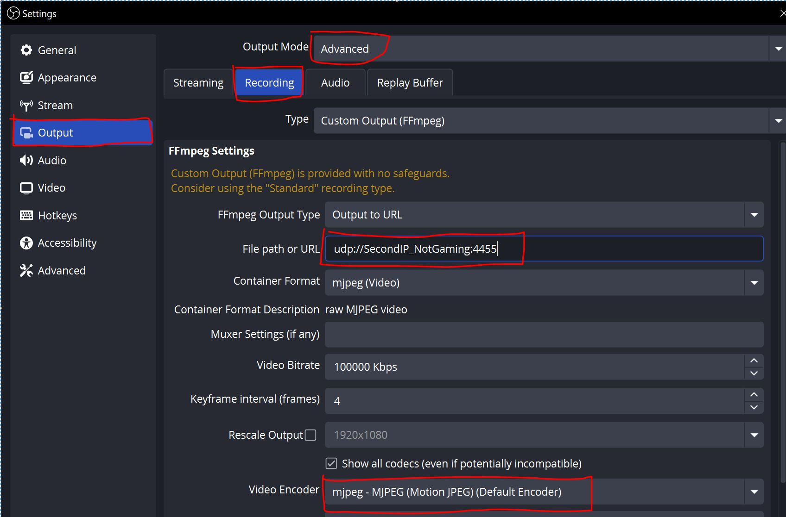
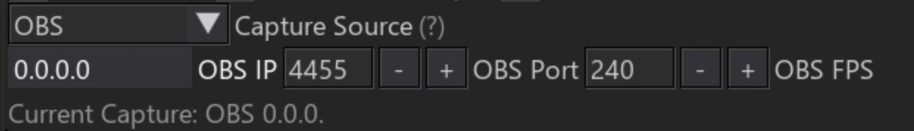

# Настройка OBS

**[🇺🇸 English](obs_en.md)**

## На игровом ПК

Следуем инструкции на скрине:

В параметрах **file path or url** указываем IP второго ПК, где находится наш бот.

### Область захвата

- Переходим в **Videos**
- **base resolution** устанавливаем под наш обзор: **640х640** или **320х320**
- Выбор зависит от вашей модели и удобства

## На основном ПК

Указываем IP как на скрине:

